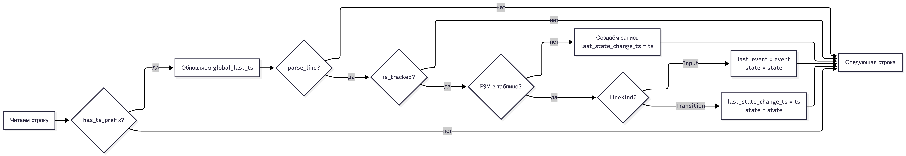
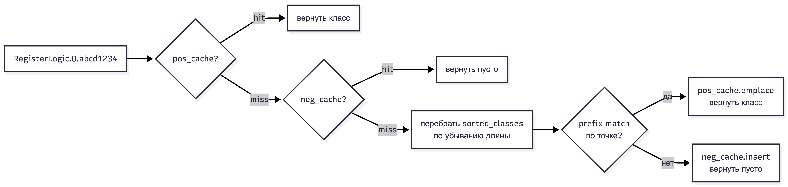

# FSM Log Analyser

Программа анализирует лог-файлы машин состояний (FSM) и выявляет «зависшие» логики — те экземпляры FSM, которые на момент последней записи в лог не находились в терминальном состоянии. Результат записывается в CSV-файл.

## Сборка и запуск

```bash
# Release
make native-release
./build-release/app <end_states.txt> <out.csv> <log1> [<log2> ...]

# Debug (с санитайзерами ASan/UBSan/LSan)
make native-debug
./build-debug/app <end_states.txt> <out.csv> <log1> [<log2> ...]

# Через Docker
make run                                        # запуск с параметрами по умолчанию
make run END_STATES=testdata/ds5/end_states.txt \
         INPUTS="testdata/ds5/in1.txt testdata/ds5/in2.txt testdata/ds5/in3.txt" \
         OUT=/tmp/result.csv                    # свои параметры
make run-debug                                  # то же, но через Debug-режим (санитайзеры)

make test1                                      # прогон ds1
make test-all                                   # все датасеты
```

## Формат файлов

**end_states.txt** — перечень классов FSM и их терминальных состояний:
```
ClassName: TERMINAL_STATE
ClassName: ANOTHER_TERMINAL_STATE
```

**Входящее сообщение в лог** (`> St:`):
```
2026-04-10 11:27:45.988 PrimFSM.cpp(37) FSM: SubscribeLogic.0.61bf91b400000002 id: 0; > St: 2 INIT_WAIT_STORAGE_CONF Pr: 38405:11 SIP_TR_SUBSCRIBE_IND
```

**Смена состояния** (`< St:`):
```
2026-04-10 11:27:45.998 PrimFSM.cpp(72) FSM: SubscribeLogic.0.61bf91b400000002 id: 0; < St: 5 PRE_ANSWER
```

**Выходной CSV**:
```
<timestamp последнего перехода>,<имя логики>,<id>,<состояние>,<последнее сообщение>,<время в состоянии>
```

## Архитектура

### Парсер строк (`parse_line`)

Разбирает строки лога без лишних аллокаций — всё через `string_view` поверх исходного буфера. Парсинг идёт последовательно по позиции `p`:

1. Проверяет наличие timestamp в начале строки по фиксированным позициям символов (`-`, `:`, `.`).
2. Ищет якорь `FSM:` — между timestamp и ним может находиться произвольный текст (имя файла, TID процесса), поэтому позиция не фиксирована.
3. Извлекает имя логики — подстрока между `FSM:` и ` id:`.
4. Парсит числовой `id` между `id:` и `;` через `std::from_chars` — без исключений и аллокаций.
5. Читает направление: `>` — входящее сообщение, `<` — смена состояния.
6. Пропускает числовой индекс состояния перед его именем (`St: 5 PRE_ANSWER` → берём `PRE_ANSWER`).
7. Для строк `>`: ищет `Pr:`, пропускает код вида `38405:11`, берёт следующий токен как имя события.

Функция возвращает `false` для всех не-FSM строк — payload, SIP-заголовки, пустые строки.

### Классификатор терминальных состояний (`EndStates`)

Загружает `end_states.txt`: каждая строка имеет формат `ClassName: STATE`. Один класс может иметь несколько терминальных состояний — все они хранятся в `unordered_set<string>` внутри `by_class`.

При загрузке строится `sorted_classes` — вектор имён классов, отсортированный по убыванию длины. Это нужно для **longest-prefix match**: при поиске класса для экземпляра `RegisterLogic.0.abcd` первым совпадёт самый длинный подходящий класс, а не произвольный. Граница совпадения — точка: `name` должно равняться классу или начинаться с `класс.`.

Результаты классификации кэшируются раздельно:
- `pos_cache` (`unordered_map<name, class>`) — для найденных совпадений,
- `neg_cache` (`unordered_set<name>`) — для имён без класса.

Разделение важно для памяти: `pos_cache` хранит строку-класс, `neg_cache` — только само имя без лишних данных. Оба кэша гарантируют O(1) на повторных обращениях.

### Таблица активных FSM (`fsms`)

`unordered_map<FsmKey, FsmState>` — основная структура данных программы. Ключ — пара `(name, id)` с кастомным хэшем на основе комбинирования хэшей Boost/FNV. В таблицу попадают **только** логики из `end_states.txt` — неотслеживаемые пропускаются сразу после `is_tracked`, что ограничивает рост памяти на шумных логах.

Каждая запись `FsmState` хранит три поля:

| Поле | Содержимое |
|------|-----------|
| `last_state_change_ts` | timestamp последней строки `< St:` |
| `state` | текущее состояние (из последней FSM-строки) |
| `last_event` | имя последнего входящего события (`> St: ... EVENT`) |

При первом появлении FSM `last_state_change_ts` инициализируется текущим `ts` строки — чтобы не было пустого значения если логика так и не совершит ни одного перехода.

### Подсчёт времени в состоянии

`global_last_ts` — максимальный timestamp среди **всех** строк всех входных файлов, включая не-FSM строки. Это принципиально: лог может заканчиваться транспортными или payload-строками с timestamp позже последней FSM-строки. Обновляется через `has_ts_prefix` до вызова `parse_line`.

Длительность = `global_last_ts − last_state_change_ts`. Вычисляется через `timegm` (системный вызов POSIX) для корректного учёта перехода через полночь. Формат результата `HH:MM:SS.mmm`, часы не ограничены 24 — для многосуточных логов может быть `49:00:00.000`.

### Формирование вывода

После обработки всех файлов программа проходит по таблице `fsms`, отбирает логики у которых `state` не входит в терминальные состояния своего класса, и складывает их в `vector<pair<FsmKey, FsmState>>`. Затем вектор сортируется по `(last_state_change_ts, name, id)` — это обеспечивает стабильный детерминированный порядок строк CSV независимо от порядка итерации по `unordered_map`.

Поля CSV экранируются: если значение содержит `,`, `"`, `\r` или `\n` — оно оборачивается в кавычки, внутренние `"` удваиваются.

### Диаграмма: основной цикл обработки строки



- **`has_ts_prefix`** — проверяет, начинается ли строка с паттерна `YYYY-MM-DD HH:MM:SS.mmm`. Если да — обновляем `global_last_ts`. Это делается для всех строк, включая payload и транспортные, чтобы получить реальный последний timestamp файла.
- **`parse_line`** — разбирает строку как FSM-событие: ищет якорь `FSM:`, извлекает имя, id, направление и состояние. Возвращает `false` для не-FSM строк.
- **`is_tracked`** — проверяет, входит ли имя FSM в один из классов из `end_states.txt`. Неотслеживаемые логики пропускаются, чтобы не хранить лишнего в памяти.
- **FSM в таблице** — если логика встречается впервые, создаём для неё запись с текущим `ts` как `last_state_change_ts`.
- **`LineKind`** — тип строки: `Input` (`> St:`) означает входящее сообщение, `Transition` (`< St:`) — смену состояния. При `Input` обновляем `last_event` и `state`. При `Transition` фиксируем новое состояние и обновляем `last_state_change_ts`.

### Диаграмма: классификация экземпляра FSM



`pos_cache` — `unordered_map<name, class>`, хранит уже найденные совпадения экземпляров с классами.
`neg_cache` — `unordered_set<name>`, хранит имена, для которых класс не найден.
Оба кэша нужны чтобы не проходить по `sorted_classes` повторно для одного и того же имени.

## Известные расхождения с эталонами

`testdata/ds2/out.csv` содержит `0` в поле duration. Программа выводит `00:00:00.027` — точное значение по последнему timestamp файла. Расхождение в формате, не в данных.
