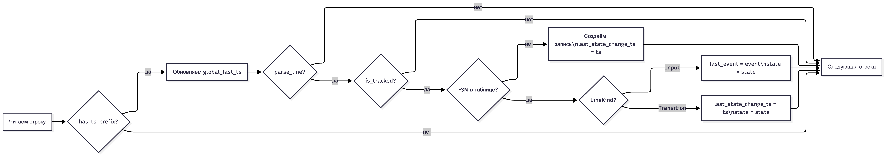
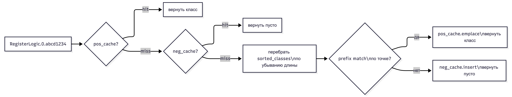

# FSM Log Analyser

Программа анализирует лог-файлы машин состояний (FSM) и выявляет «зависшие» логики — те экземпляры FSM, которые на момент последней записи в лог не находились в терминальном состоянии. Результат записывается в CSV-файл.

## Сборка и запуск

```bash
# Release
make native-release
./build-release/app <end_states.txt> <out.csv> <log1> [<log2> ...]

# Debug (с санитайзерами ASan/UBSan/LSan)
make native-debug
./build-debug/app <end_states.txt> <out.csv> <log1> [<log2> ...]

# Через Docker
make run                                        # запуск с параметрами по умолчанию
make run END_STATES=testdata/ds5/end_states.txt \
         INPUTS="testdata/ds5/in1.txt testdata/ds5/in2.txt testdata/ds5/in3.txt" \
         OUT=/tmp/result.csv                    # свои параметры
make run-debug                                  # то же, но через Debug-режим (санитайзеры)

make test1                                      # прогон ds1
make test-all                                   # все датасеты
```

## Формат файлов

**end_states.txt** — перечень классов FSM и их терминальных состояний:
```
ClassName: TERMINAL_STATE
ClassName: ANOTHER_TERMINAL_STATE
```

**Входящее сообщение в лог** (`> St:`):
```
2026-04-10 11:27:45.988 PrimFSM.cpp(37) FSM: SubscribeLogic.0.61bf91b400000002 id: 0; > St: 2 INIT_WAIT_STORAGE_CONF Pr: 38405:11 SIP_TR_SUBSCRIBE_IND
```

**Смена состояния** (`< St:`):
```
2026-04-10 11:27:45.998 PrimFSM.cpp(72) FSM: SubscribeLogic.0.61bf91b400000002 id: 0; < St: 5 PRE_ANSWER
```

**Выходной CSV**:
```
<timestamp последнего перехода>,<имя логики>,<id>,<состояние>,<последнее сообщение>,<время в состоянии>
```

## Архитектура

### Компоненты

**`parse_line`** — разбирает одну строку лога без аллокаций (`string_view`). Ищет якорь `FSM:`, извлекает имя, id, направление (`>` / `<`), состояние и имя события. Возвращает `false` для всех не-FSM строк.

**`EndStates`** — загружает `end_states.txt` и классифицирует экземпляры FSM по классу через longest-prefix match с границей по точке (`RegisterLogic.0.abc` → класс `RegisterLogic`). Результаты кэшируются раздельно для положительных (`pos_cache`) и отрицательных (`neg_cache`) совпадений.

**Таблица `fsms`** — `unordered_map<FsmKey, FsmState>`, хранит последнее известное состояние каждой отслеживаемой логики. Ключ — пара `(name, id)`. В таблицу попадают только логики из `end_states.txt`.

**Вывод** — после обработки всех файлов зависшие FSM собираются в `vector`, сортируются по `(last_state_change_ts, name, id)` для стабильного вывода и записываются в CSV.

### Семантика полей

| Поле | Обновляется при |
|------|----------------|
| `last_state_change_ts` | строке `< St:` |
| `state` | любой FSM-строке |
| `last_event` | строке `> St:` |
| `global_last_ts` | **любой** строке с валидным timestamp |

`global_last_ts` намеренно обновляется из всех строк файла, а не только из FSM-строк — задание требует «последний timestamp в файле», а лог содержит payload-строки, которые могут идти позже последней FSM-строки.

Длительность нахождения в состоянии = `global_last_ts − last_state_change_ts`, формат `HH:MM:SS.mmm`. Часы не ограничены 24 — для многосуточных логов корректно выдаёт, например, `49:00:00.000`.

### Диаграмма: основной цикл обработки строки



### Диаграмма: классификация экземпляра FSM



## Известные расхождения с эталонами

`testdata/ds2/out.csv` содержит `0` в поле duration. Программа выводит `00:00:00.027` — точное значение по последнему timestamp файла. Расхождение в формате, не в данных.
